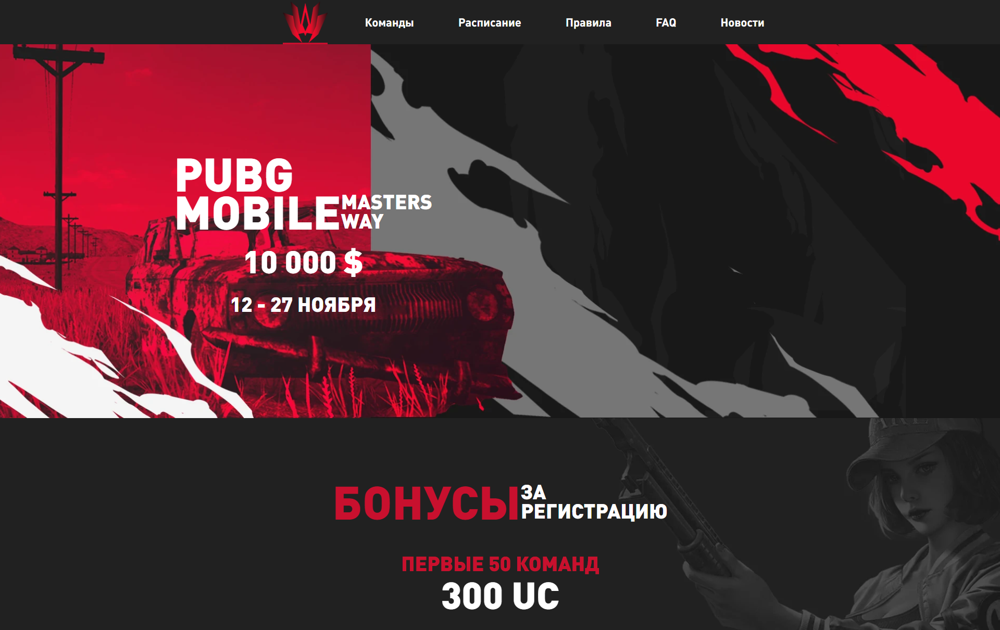

# Pubg masters way

### 📋 Многостраничный сайт для турнира по Pubg mobile.

🔗 URL: <a href="https://pubg-masters-way-arshtnkv.vercel.app/" target="_blank">pubg-masters-way-arshtnkv.vercel.app</a>

<br clear="both">

<div>
  
</div>

### 🛠 Технологии:
- Pug
- Sass
- Java Script (ECMAScript 6)
- Gulp, Webpack

### 💡 Описание:
Вёрстка данного проекта выполнена с учетом последующей интеграции шаблона в wordpress.<br>
Основной функционал включает:
- Первый экран.
- Информацию о турнире.
- Форма регистрации.
- Таблицы с командами и расписанием турнира внутри табов и аккордионов.
- Слайдеры.
- Бургер (мобильное) меню.

### Основные команды для работы:

- Установка 
```
npm i
```

- Запуск локального сервера без минификаций
```
npm start
```

- Запуск локального сервера c минификациями, <br>
данный вариант не используется в разработке, <br>
он нужен только для тестов производительности <br>
на локальном хосте
```
npm run dev
```

- Сборка проекта, минификация скриптов <br>
и оптимизация изображений перед деплоем на прод
```
npm run build
```

- Запуск тестирования на соответствия кодгайдам
```
npm test
```

- Создание webp изображений в директории source
```
npm run webp
```

### Вся разработка ведётся в директории `source`
### Итоговый код попадает в директорию `build`

